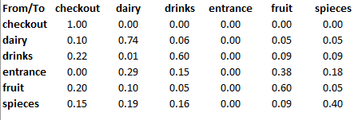

# Simulate customer behaviour

## Synopsis
The goal of this project is to simulate the customer behaviour in a supermarket.

## Data
The analysis and calculation of the transition probabilities (probability of switiching from section A to B) are based on the data in the *customer_data* folder. 

### Data Exploration
*to be added*

### Transition Probabilites
These are calculated in the file *transition_prob_git.py* and the result is saved in a csv file. In the Pythin file, there are some fields that need to be filled: path to the customer data and credentials of the PostGreSQL database where the data is saved.

## Class Customer
This class is defined in *customer3.py* and represents a customer of a supermarket. To create an instance of this class the transition probabilities and a list with all possible states (i.e., sections in the supermarket: checkout, dairy, drinks...) are needed.

### Attributes
Among others: Transition probability matrix, current state, coordinates (x,y) of the customer in the supermarket, complete path of the customer,... 

### Methods
Generate the complete path in the supermarket, move through x and y axis, random generation of the next state, calculate the coordinates of the next section,...

## Simulation
It uses a Markov model to simulate the path of a customer in the supermarket; a Markov model (Markov Chain) assumes that the future state depends only on the current and not on the previous ones. 

Once the customer reaches the "checkout", the program doesn't simulate him/her any longer.

## Visualization
The cv2 library is used for the visualization of the customers in the supermarket. To visualize the supermarket and its customers, run *visualize.py*.

